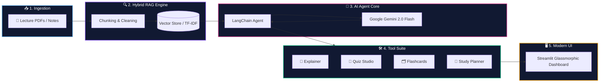

<div align="center">

# 🎓 Study Buddy AI Agent
### *Next-Generation Autonomous AI Academic Companion & Study Suite*

<p align="center">
  <a href="https://www.python.org/"></a>
  <a href="https://streamlit.io/"></a>
  <a href="https://aistudio.google.com/"></a>
  <a href="https://www.langchain.com/"></a>
  <a href="LICENSE"></a>
  <a href="https://github.com/"></a>
</p>

<p align="center">
  <b>Transform complex lecture slides, textbook PDFs, and study notes into instant interactive summaries, auto-graded practice quizzes, 3D animated flashcards, and personalized revision schedules.</b>
</p>

---

[✨ Key Features](#-key-features) • [⚡ System Architecture](#-how-it-works) • [🚀 Quickstart Guide](#-installation--quickstart) • [🪟 Windows Setup](#-windows--vs-code) • [🍎 macOS / Linux](#-macos--linux-setup) • [🛠️ Troubleshooting](#-common-errors) • [💻 Tech Stack](#-technology-stack)

---

</div>

## 🌟 Key Features

<table align="center" width="100%">
<tr>
<td width="50%" valign="top">

### 🧠 Concept Explainer
`🏷️ Adaptive Multi-Tier` `🎯 ELI5 Analogies`
- **Beginner (ELI5):** Breaks down dense concepts with real-world analogies.
- **Intermediate:** Detailed logical flowcharts and mechanisms.
- **Advanced:** Academic depth, edge cases, and technical rigor.

</td>
<td width="50%" valign="top">

### 📝 Quiz Studio & Auto-Grader
`⚡ Instant Scoring` `📊 Feedback Matrix`
- Generates **MCQs, True/False, and Short Answer** questions from your notes.
- Evaluates student answers on a **0–100 scale** with instant constructive critique.

</td>
</tr>
<tr>
<td width="50%" valign="top">

### 🗂️ 3D Animated Flashcards
`📈 Spaced Repetition` `🔄 Flip Animations`
- Interactive flippable study cards powered by memory retention science.
- Self-assessment tracking with mastery filters.

</td>
<td width="50%" valign="top">

### 📅 Smart Revision Planner
`📆 Exam-Targeted` `⏳ Dynamic Roadmaps`
- Generates customizable multi-day study schedules (up to 30 days).
- Prioritizes difficult topics first with spaced review checkpoints.

</td>
</tr>
<tr>
<td width="50%" valign="top">

### 📑 Document Summarizer & Extractor
`🔍 Semantic RAG` `📑 PDF & TXT Ingestion`
- Multi-page document parsing with dual-engine PDF processing (`pdfplumber` + `pypdf`).
- Automatic formula, definition, and topic hierarchy extraction.

</td>
<td width="50%" valign="top">

### 📄 One-Click PDF Report Export
`🖨️ Publication Ready` `📥 Downloadable`
- Export customized study guides, practice exams, and revision calendars to cleanly styled PDF reports via ReportLab.

</td>
</tr>
</table>

---

## ⚡ How It Works



---

## 🚀 Installation & Quickstart

### 📌 Requirements

Before starting, install:
* Python **3.10 or 3.11**
* **VS Code**
* **Git**
* A free **Google Gemini API Key** ([Get your free key here](https://aistudio.google.com/app/apikey))

---

## 🪟 Windows + VS Code

### 1. Open the Project
Open the project folder in **VS Code**.  
Then open:  
**Terminal → New Terminal** (or press `Ctrl + ~`)

---

### 2. Check Python
Run:
```powershell
python --version
```
You should see Python 3.10 or 3.11.  
If `python` does not work, try:
```powershell
py --version
```

---

### 3. Create Virtual Environment
Run:
```powershell
python -m venv .venv
```
This will automatically create a `.venv` folder.

---

### 4. Activate Virtual Environment
Run:
```powershell
.\.venv\Scripts\Activate.ps1
```
If it works, you will see `(.venv)` at the beginning of the terminal.

---

### ⚠️ If You Get a PowerShell Error
If you see:
```text
running scripts is disabled on this system
```
Run:
```powershell
Set-ExecutionPolicy -ExecutionPolicy RemoteSigned -Scope CurrentUser
```
Press **`Y`** and Enter.  
Then activate the environment again:
```powershell
.\.venv\Scripts\Activate.ps1
```

---

### 5. Install Required Packages
Run:
```powershell
python -m pip install --upgrade pip
python -m pip install -r requirements.txt
```
Wait until the installation is complete.

---

### 6. Create the `.env` File
Copy the example file:
```powershell
Copy-Item .env.example .env
```
Open the `.env` file and add your Gemini API key:
```env
GEMINI_API_KEY=your_actual_gemini_api_key_here
```

> **🔒 Important:** Never share or upload your `.env` file or API key to GitHub.

---

### 7. Run the Application
Run:
```powershell
streamlit run app.py
```
The application will open in your browser.  
If it does not open automatically, go to:  
👉 **`http://localhost:8501`**

---

## 🍎 macOS / Linux Setup

1. **Open Terminal** in the project folder.
2. **Create and activate virtual environment**:
   ```bash
   python3 -m venv .venv
   source .venv/bin/activate
   ```
3. **Upgrade pip & install dependencies**:
   ```bash
   pip install --upgrade pip
   pip install -r requirements.txt
   ```
4. **Create `.env` file**:
   ```bash
   cp .env.example .env
   ```
   Add your `GEMINI_API_KEY` inside `.env`.
5. **Run the application**:
   ```bash
   streamlit run app.py
   ```

---

## ⚡ After First Setup

You don't need to create the virtual environment again.

Every time you open the project, simply run:

```powershell
.\.venv\Scripts\Activate.ps1
streamlit run app.py
```

That's it! 🎓

---

## 🛠️ Common Errors

### Python not found
Try:
```powershell
py -3.11 -m venv .venv
```
Then activate:
```powershell
.\.venv\Scripts\Activate.ps1
```

### PowerShell activation error
Run:
```powershell
Set-ExecutionPolicy -ExecutionPolicy RemoteSigned -Scope CurrentUser
```
Then activate again:
```powershell
.\.venv\Scripts\Activate.ps1
```

### `No module named ...`
Make sure `(.venv)` is visible in the terminal, then run:
```powershell
python -m pip install -r requirements.txt
```

### Streamlit not found
Run:
```powershell
python -m streamlit run app.py
```

---

## 💻 Technology Stack

| Layer | Technology | Purpose |
|---|---|---|
| **Frontend UI** | `Streamlit 1.30+` | Glassmorphic dark-mode web dashboard |
| **Agent Framework** | `LangChain 0.2+` | Autonomous multi-tool orchestration |
| **LLM Engine** | `Google Gemini 2.0 Flash` | High-speed reasoning and content generation |
| **Vector Retrieval** | `FAISS` / `Scikit-Learn TF-IDF` | Dual-engine RAG semantic indexing |
| **PDF Extraction** | `pdfplumber` + `pypdf` | Multi-page text and document parsing |
| **Document Export** | `ReportLab` | Clean, styled PDF study report generation |

---

<div align="center">

### ⭐ Star this repository if you find it helpful!

Made with ❤️ for students, educators, and lifelong learners.

**[⬆ Back to Top](#-study-buddy-ai-agent)**

</div>
